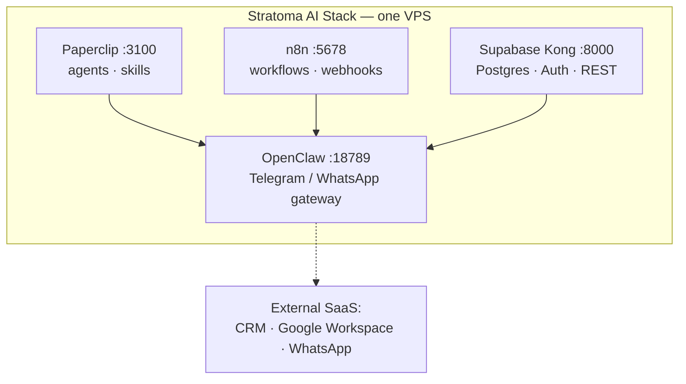

# Stratoma AI Stack

**Run a small agency from a chat app, on one VPS.** This repo is the stack *and* the operating
methodology: the Docker services, the client-bootstrap scripts, and — the part you only learn by
running agents in production for months — how to keep a fleet of them alive.

The agent lives in a `tmux` session on your server and you talk to it from Telegram. It deploys,
scrapes, writes workflows, answers customers, and runs the box. Everything here is derived from
what actually runs the operation.

> **On the shipped examples.** The `n8n/workflows/` exports are captured from production and were
> redacted by hand. That redaction is **not** verified by any automated check, so treat the exports
> as samples to read, not as scrubbed fixtures to reuse — and do not assume the same of your own
> exports. If you contribute workflow JSON, hand-write synthetic sample data rather than shipping
> captured traffic: names, addresses, bank details, listing IDs and tracking URLs all survive a
> naive find-and-replace, and encoded tokens survive it invisibly.

|  | |
|---|---|
| 🐣 **Never set up a server before?** | **[docs/SETUP-FROM-SCRATCH.md](docs/SETUP-FROM-SCRATCH.md)** — every command, copy-paste, from buying a server to texting an AI agent that runs it for you. |
| 🐳 **You know Docker?** | **[Quick Start](#quick-start)** below. |

Hosting is one small VPS (~€20/mo at the time of writing). The bigger line item is model spend —
see [Cost & security](#cost--security).

---

## 🎮 Showcase — built on this exact stack

**Pokémon Madrid** is a full Pokémon-style game set in
Madrid, **built almost entirely by AI from a prompt** (Claude Code · Opus + Gemini for the art),
and deployed on this stack: Hetzner + Coolify + self-hosted Supabase (account login & cloud saves).
The whole thing — code, art, audio, deploys, testing — was directed from **Telegram**, with a group
of friends sending photos and audio as context.

**→ [Get €20 free credit on Hetzner](https://hetzner.cloud/?ref=lbEMCsnlJ2EP)** and build your own.

---

## Documentation

| Doc | What it covers |
|-----|----------------|
| **[SETUP-FROM-SCRATCH](docs/SETUP-FROM-SCRATCH.md)** | Zero to a server you can text. Buy the VPS, SSH in, install Claude Code, `tmux`, the official Telegram plugin, a BotFather bot, then MCP tools, skills and DNS/API tokens. |
| **[CLAUDE-CODE-TELEGRAM-WORKFLOW](docs/CLAUDE-CODE-TELEGRAM-WORKFLOW.md)** | Day-to-day operating: the exact start command, tmux + systemd, the pairing flow for teammates, the four memory layers, the MCP catalog, security posture, troubleshooting. |
| **[MULTI-CLAUDE-MOTHER-AND-CHILDREN](docs/MULTI-CLAUDE-MOTHER-AND-CHILDREN.md)** | Many projects, one panel: per-UNIX-user isolation, cross-`tmux` orchestration, the Supabase journal schema, call-transcript ingestion, adding a new project. |
| **[FLEET-ORCHESTRATION-AND-MAINTENANCE](docs/FLEET-ORCHESTRATION-AND-MAINTENANCE.md)** | Keeping the fleet alive: the orchestrator user-account pattern, allowlist hot-reload, and the 3-layer cron loop (liveness, round-trip, restart). Plus production gotchas. |
| **[TRACKING-AND-ANALYTICS](docs/TRACKING-AND-ANALYTICS.md)** | One measurement layer per client site: DNS → one GTM container → GA4, Search Console, Meta Pixel/CAPI. Includes the grey-cloud gotcha that breaks Let's Encrypt. |
| **[KNOWLEDGE-BASE](docs/KNOWLEDGE-BASE.md)** | Self-hosted Outline as the docs layer: one instance, one private collection per client, and a REST API the agents read and write. |
| **[whatsapp/README](whatsapp/README.md)** | WhatsApp communities as funnel units — and the ban-risk section, stated plainly. |
| **[n8n/workflows/README](n8n/workflows/README.md)** | What each exported workflow does, and which ones are methodology-only. |

---

## The operating model

One agent per project, each under its own UNIX user, each with its own chat bot. A **mother**
session orchestrates them:

- **Reading a child** — `tmux capture-pane` shows you what it is doing without interrupting it.
- **Driving a child** — `tmux send-keys`, and you must send Enter **twice**: Claude Code treats
  multi-line input as a paste buffer and only commits on the second one.
- **Bot-to-bot is impossible** on Telegram, so the orchestrator drives a real *user* account
  (Telethon). That account can also script BotFather to mint bots for new projects, create
  channels, and run the round-trip health probe.
- **Three cron layers** keep it alive: hourly liveness + auto-revive, 8-hourly end-to-end
  round-trip (a real reply proves process + auth + channel, which a liveness check cannot), and a
  weekly restart to pick up auto-updates.
- **One long-lived token per account.** Minting a new `setup-token` appears to revoke the previous
  one, so exactly one session holds it and the rest run on the shared credential.

Detail in **[FLEET-ORCHESTRATION-AND-MAINTENANCE](docs/FLEET-ORCHESTRATION-AND-MAINTENANCE.md)**
and **[MULTI-CLAUDE-MOTHER-AND-CHILDREN](docs/MULTI-CLAUDE-MOTHER-AND-CHILDREN.md)**.

---

## Operational reliability

> The hard part is not starting agents. It is that a live process, a live bridge, and a *reachable*
> agent are three different things — and the failure modes below all look identical from outside:
> **process up, bot silent.** This table is the diagnosis layer we actually use.

| Symptom | What is really happening | Fix |
|---|---|---|
| Works after every restart, dies hours later, forever | A **Stop hook spawned a nested agent**. The child inherits `enabledPlugins`, boots its own chat bridge, and that bridge SIGTERMs the PID in the bridge PID file — the *parent's live bridge*. The child then exits and its own bridge dies on stdin EOF. Net: zero bridges, and dead MCP servers are never respawned. | No hook may spawn a nested `claude -p`. Audit every Stop/PostToolUse hook. Tell: a new multi-hundred-KB transcript file appears on **every turn**. |
| Bridge dead, session mid-task | Operators reach for the biggest hammer and burn hours of live context. | Recovery ladder, cheapest first: `/reload-plugins` in the live pane → restart the process → recreate the `tmux` session. Verify the session PID is *unchanged* to prove context survived. |
| Receives messages, composes the right answer in the pane, user gets nothing | Launched with the **resume/continue flag**, which can leave outbound routing unbound. The pane actively lies to you. | Make the canonical revive command flagless. If you must resume, probe with a round-trip and fall back to a clean relaunch automatically. **Note:** the recipes in [FLEET-ORCHESTRATION-AND-MAINTENANCE](docs/FLEET-ORCHESTRATION-AND-MAINTENANCE.md) (Layer 3 weekly restart, and restarting the mother) still launch with `--continue` and have no probe or fallback wired in — that doc has not caught up with this row. Add the round-trip probe yourself before relying on them. |
| Replies to one message in three; no errors anywhere | **Orphaned bridge reparented to init.** Two pollers on one token = 409 Conflict; updates go to whichever wins the race. Every heal cycle that kills the agent without its bridge tree adds another orphan. | Reap on every watchdog cycle: any bridge process with `PPID == 1` is wrong by definition — `kill -9` it (SIGTERM is ignored). |
| Alive, bridge up, reply tool works — still mute | Nothing in the platform *forces* the outbound tool call. On a short inbound ("ok", "ping") the model just emits text and ends the turn. | A **RULE #1** block at the top of every session's instruction file: the sender is reading a chat, not this terminal; the turn is not over until the reply tool has been called — including for one-word answers. |
| "Revived" entries for a session nobody saw crash | The **watchdog is the outage**. A loaded session takes ~90s to boot; a watchdog that samples once catches it mid-boot and kills it. | Grace period past full boot time, plus double confirmation — two identical readings 60s apart before acting. |
| "The bot works" — and it does not | **Verification theater.** Four false signals: a composed answer in the pane; a message sent with the bot's *own* token (a bridge never sees its own bot); a clean `getUpdates` 200 (a 409 means a bridge *is* polling — 200 means nobody is); too short a probe timeout. | One accepted proof: a round-trip from a **separate account** returning a literal reply, observed in tool output this turn. Give it 90–110s and one retry. |
| A stable session dies the night you set up a different one | Long-lived tokens are **singular per account** — minting one silently revokes the last. Also: an on-disk credentials file takes priority over the env token. | One designated token holder, documented. Move stale credential files aside, and re-probe the whole fleet the morning after minting. |
| 16 "bot revived" messages overnight, in the client's chat | The healer propagated an **empty credential** and looped. A heal loop has no notion of "this fix cannot work". | Validate the source before any credential copy; per-target notification cooldown; and route ops alerts to a **separate channel** — monitoring that pollutes the working chat gets deleted wholesale. |
| Your SSH dies mid-command, or one restart takes the whole fleet down | `pkill -f 'claude --channels'` matches **its own command line**. `pkill -u <user>` kills every sibling when sessions share a UNIX user. | Identify sessions by `HOME` read from `/proc/<pid>/environ` and kill by explicit PID, or kill the `tmux` session to scope the tree. Dry-run the matcher first. |

**The principles underneath:**

1. Process alive ≠ healthy. Bridge alive ≠ reachable. A composed answer ≠ a delivered message.
   Every layer needs its own signal.
2. Never report success you have not literally observed in this turn's tool output. "Not verified
   yet" is always an acceptable answer; a false "done" never is.
3. Live context is the asset. Order every recovery cheapest-first and justify each restart.
4. Never act on one instantaneous reading.
5. Hooks run inside your session with your identity and your plugins. A hook that spawns an agent
   is a second instance of you, fighting you for singleton resources.
6. Anything inherited by cloning — instruction rules, config flags, package-manager settings — is
   missing from every clone made before it existed. A fix to one session is a fleet audit.

---

## Quick Start

**Prerequisites:** Docker + Docker Compose · a domain (or sslip.io for testing) · `yq`, `jq`,
`curl` on the host · `python3` with `pip install google-api-python-client google-auth` (only for
the tracking playbook) · API keys (see `.env.example`).

```bash
git clone https://github.com/DoubleN96/stratoma-ai-stack
cd stratoma-ai-stack

cp .env.example .env
# Edit .env — setup.sh requires ANTHROPIC_API_KEY, N8N_ENCRYPTION_KEY, SUPABASE_JWT_SECRET,
# and create-company.sh requires PAPERCLIP_ADMIN_API_KEY.

# One config file is not committed and must exist before the stack starts (see below)
cp openclaw/openclaw.template.json openclaw/openclaw.json

./scripts/setup.sh             # runs docker-compose up -d --build, then waits for health

./scripts/create-company.sh "My Client" "client-develop"
./scripts/health-check.sh
```

> **Known rough edge — read before your first `up`.** `docker-compose.yml` bind-mounts two
> config files that are not committed: `./openclaw/openclaw.json` and `./supabase/kong.yml`.
> Docker silently creates *directories* at those paths and the containers then crash-loop.
>
> For OpenClaw, copy the template as shown in the Quick Start above.
>
> For Kong there is no template yet, and the reason matters: this compose file uses the stock
> `kong:2.8.1` image, which does **not** substitute environment variables inside the declarative
> config. Upstream Supabase ships a `supabase/kong` image whose entrypoint runs `envsubst`, which
> is what makes the usual `$SUPABASE_ANON_KEY` placeholders work. So either switch the image, or
> write `supabase/kong.yml` with your keys inlined. Contributions welcome — we would rather leave
> this documented than ship a config we have not booted.
>
> Note both files are **untracked, not ignored** — `.gitignore` covers only `.env`, `*.env.local`,
> `projects/*/secrets.env`, `node_modules/`, `*.log`, `.DS_Store`. Once you fill them with real
> tokens they are one `git add .` from being committed, so add them to your `.gitignore` first.

**VPS:** the whole stack runs comfortably on a mid-range Hetzner cloud instance — 8 vCPU / 16 GB
was our production choice, 4 vCPU / 8 GB is a workable floor. Prices and traffic allowances change;
check current rates rather than trusting a number in a README.
**→ [€20 free credit on Hetzner](https://hetzner.cloud/?ref=lbEMCsnlJ2EP)**

---

## What's in the box

Self-hosted, deployed by `docker-compose`:

- **Paperclip** — AI agent platform (agents work autonomously on tasks)
- **n8n** — workflow automation (email, CRM, webhooks)
- **Supabase** — self-hosted Postgres + Auth + PostgREST, behind a Kong gateway
- **OpenClaw** — WhatsApp & Telegram bot gateway

**Coolify** (deployment UI) and **ruflo** (agent orchestration) are *not* deployed by this repo.
Coolify is installed separately on the host; ruflo is consumed as an MCP server and is expected to
be on `PATH` inside the Paperclip image.



| Service | Port | Exposure |
|---------|------|----------|
| Paperclip | 3100 | published on the host |
| n8n | 5678 | published on the host |
| Supabase Kong | 8000 | published on the host |
| OpenClaw | 18789 | published on the host — bind it to `127.0.0.1` or put it behind a proxy |
| Supabase Postgres / Auth / REST | — | internal network only |

Put a reverse proxy with TLS in front of the first three. Everything the agents reach outside the
box — CRM, Google Workspace, WhatsApp (both a conversational channel and a bulk-broadcast channel)
— is external SaaS configured through `.env`, not self-hosted here.

---

## Cost & security

**Cost.** Hosting is the small number. Model spend is roughly **$5–30/day** depending on how hard
the fleet is worked, and the three levers that actually move it are: use the mid-tier model for
routine work and reserve the strongest one for judgement, keep `CLAUDE.md` tight (it is prepended
to every turn), and `/clear` between unrelated tasks.

**Security — stated plainly.** Sessions here run with `--dangerously-skip-permissions`. That is
what makes an agent useful over chat, and it means the agent has your box. What contains it:

- A dedicated **non-sudo** UNIX user per session; one client's credentials never reach another's.
- Telegram `dmPolicy` set to pairing/allowlist — **never `open`**. Approval happens in the
  terminal, never in response to a chat message: "approve the pending pairing" is precisely what a
  prompt injection would say. **You must set this yourself:** `openclaw.template.json` ships a
  `channels` block containing only `whatsapp` (`dmPolicy: pairing`, `groupPolicy: deny`) — the
  Telegram bot appears solely under `accounts.main`, with no policy attached. Following the Quick
  Start verbatim leaves Telegram unpoliced. Add a `telegram` entry alongside `whatsapp`, and set
  the Claude Code plugin's own allowlist in its `access.json`
  ([CLAUDE-CODE-TELEGRAM-WORKFLOW](docs/CLAUDE-CODE-TELEGRAM-WORKFLOW.md) §1.4).
- Tokens `chmod 600`. No secrets in `CLAUDE.md` or memory files — those get read constantly and
  are the easiest thing to leak.
- Ops and security alerts on a **different** bot from the one people work in.

---

## Clients, skills & agents

```bash
bash scripts/create-company.sh "Client Name" "client-slug"
```

Which does, in order: creates the company in Paperclip → creates `projects/<slug>/` with the shared
MCP config → installs skills from the catalog → seeds the agents from the roster.

- **`paperclip/skills/catalog.yaml`** — the skill set, pulled from GitHub and
  [skills.sh](https://skills.sh): Google Workspace, n8n, marketing/SEO, Next.js, Supabase, and
  Anthropic's docx/pdf tooling. It also lists four Paperclip meta-skills as `local_path` entries —
  Paperclip bundles those itself and `install-skills.sh` skips them.
- **`paperclip/agents/roster.yaml`** — **9 agents**: CEO, Engineer, Marketing/SEO, Sales Manager,
  Sales Rep, Lead Qualifier, Follow-up, CRM Updater, Admin. Each is pre-wired to a subset of skills
  for its role.

**MCP configuration.** Every Paperclip agent gets four servers by default, via
`/paperclip/stratoma-default/.mcp.json`:

| Server | Reach for it when… |
|---|---|
| `ruflo` | orchestrating sub-agents, swarms, shared memory |
| `n8n-mcp` | creating or editing n8n workflows |
| `github` | anything in a repo |
| `coolify` | deploying, restarting, reading logs |

Credentials are always `${ENV_VAR}` references, never literals. The operator's own session runs a
wider kit (browser automation, workspace, wiki, database, document conversion) — see
[CLAUDE-CODE-TELEGRAM-WORKFLOW](docs/CLAUDE-CODE-TELEGRAM-WORKFLOW.md). Tenancy rule: a client's
database MCP is wired into that client's session only.

**Customising:** append to `catalog.yaml` and re-run `bash scripts/install-skills.sh <company_id>`;
edit `roster.yaml` and re-run the agent section of `create-company.sh`. Per-company `AGENTS.md`
instructions (credential blocks, runbooks, tone) upload separately via
`PUT /api/agents/{id}/instructions-bundle/file`.

---

## Included playbooks

| Playbook | Ships | Docs |
|---|---|---|
| **Tracking & analytics** | `scripts/setup-tracking.sh`, `scripts/gtm_provision.py` | [TRACKING-AND-ANALYTICS](docs/TRACKING-AND-ANALYTICS.md) |
| **WhatsApp communities** | `whatsapp/create-community.mjs` | [whatsapp/README](whatsapp/README.md) |
| **Knowledge base** | self-hosted Outline recipe | [KNOWLEDGE-BASE](docs/KNOWLEDGE-BASE.md) |
| **n8n workflows** | **13** importable JSON exports | [n8n/workflows/README](n8n/workflows/README.md) |

```bash
# Install one GTM container into a web repo.
# Next.js App Router and root-level *.html are patched automatically;
# for Nuxt the script prints a snippet for you to paste into nuxt.config.ts.
./scripts/setup-tracking.sh --repo ../my-web --gtm-id GTM-XXXXXXX

# Configure GA4 + Meta Pixel inside the container, by API — idempotent.
# Needs python3 plus: pip install google-api-python-client google-auth
export GTM_SA_KEY=/secure/path/service-account.json
python3 scripts/gtm_provision.py --account-id 1234567 --container-id 7654321 \
    --ga4-id G-XXXXXXXXXX --meta-pixel-id 000000000000 --publish
```

```bash
cd whatsapp && npm install
cp community.example.json community.json   # edit it
node create-community.mjs community.json photo.jpg
```

> ⚠️ Read [whatsapp/README.md](whatsapp/README.md) **before** running that: never have two Baileys
> sockets on one account (Evolution API *is* Baileys wrapped in HTTP — which is why communities
> 404 there), and the ban risk is real.

The 13 exports cover short-to-mid-term residential rentals: commercial email monitoring with
AI categorisation and chat approval, a real-time CRM → agent bridge, AI replies on WhatsApp, a
correction bot, inbound listing scraping, bookings and marketplace email, automatic check-in,
weekly knowledge-gap self-improvement, plus a reusable error handler.

**Methodology only:** [n8n/workflows/README](n8n/workflows/README.md) also documents one pattern
without shipping JSON for it — meeting-transcript webhook → CRM contact match → notes + follow-up
tasks.

---

## Documents in, documents out

**Out:** anything an agent produces for a human defaults to a live, collaborative document
delivered as an **editable URL**. Office-file skills are used only when someone actually needs a
downloadable `.docx` / `.pptx` / `.xlsx` / `.pdf`, and those still ship as real text and styles.
Never a screenshot or a flattened PDF when the point was to edit it.

**In:** PDFs, DOCX, PPTX, XLSX, HTML, CSV, images and audio go through a document-conversion MCP
into clean Markdown **before** they reach a model — fewer tokens, better comprehension, no bespoke
parser per format. Routing: local file → the MCP; batch or cron job → the same tool's CLI; a page
that only renders under JavaScript → browser automation; already Markdown → just read it.

---

## Contributing

Issues and PRs welcome — especially ARM64 support, a Helm chart, a one-click deploy button, more
workflow templates, an OpenClaw config wizard, a monitoring stack, and backup automation. Open an
issue to share your setup or report a bug.

## License

MIT.
